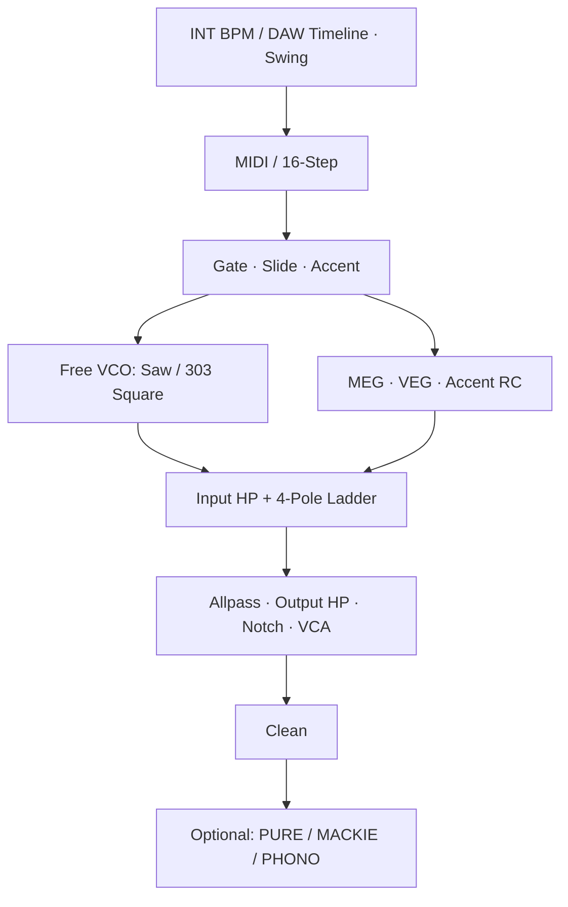

# ACIDIFY – Produkt- und DSP-Konzept

## 1. Ziel und Beleggrenze

ACIDIFY soll Spielweise und Klangcharakter einer TB-303 in Amorph reproduzieren
und eine getrennte, für Acid-Produktionen typische Ausgangsverzerrung anbieten.
Der Instrumentenkern bleibt auch bei ausgeschalteter Distortion vollständig
spielbar und messbar.

0.7.0 ist ein technisch geprüfter Modellkandidat. „AAA Clone“ wird erst
beansprucht, wenn identische Pattern mehrerer Originalgeräte kalibriert
aufgenommen, gegen das Modell vermessen und im Blindtest bewertet wurden.
Quellcodequalität und grüne Offline-Tests ersetzen diesen Hör- und
Hardwarebeleg nicht.

## 2. Belegte Klangbausteine

### Primär- und Fachquellen

- Die
  [Roland TB-303 Service Notes](https://notebook.zoeblade.com/Downloads/Documentation/Roland/TB-303_service_notes.pdf)
  liefern Schaltplan, Abgleichpunkte und VCF-/Accent-Signalwege.
- [Robin Whittles Accent-Analyse](https://www.firstpr.com.au/rwi/dfish/303-unique.html)
  beschreibt MEG, VEG und das Accent-Sweep-Netzwerk aus Diode, 47 kΩ,
  dualem 100-kΩ-Resonance-Poti, 1 µF und 100-kΩ-Summierwiderstand.
- Tim Stinchcombes
  [Diodenleiter-Analyse](https://www.timstinchcombe.co.uk/index.php?pge=diode2)
  zeigt den Einfluss der Koppelkondensatoren, zusätzlichen Pole und Nullstellen
  auf Bass- und Resonanzverlauf.
- [Open303](https://github.com/RobinSchmidt/Open303) liefert unter MIT-Lizenz
  gemessene Cutoff-/Env-Mod-Kennlinien, TB-Filterrekursion,
  Koppelfrequenzen, Hüllkurvenzeiten, Square-Shaper-Konstanten,
  Slide-Zeit und Sequencer-Gate-Länge.
- [Airwindows](https://github.com/ClarkParker/airwindows) liefert unter
  MIT-Lizenz die getrennten Post-FX-Algorithmen PurestDrive und Mackity.

Exakte Commits, Dateien, Blob-SHAs und Lizenztexte stehen in
[THIRD_PARTY_NOTICES.md](../THIRD_PARTY_NOTICES.md).

### Konsequenz

Der 303-Fingerabdruck entsteht nicht aus Resonanz oder Distortion allein,
sondern aus dem gekoppelten Verhalten von:

1. frei laufendem VCO und 303-spezifischem Saw/Square-Verhältnis,
2. Gate, Slide und monophoner Notenpriorität,
3. MEG und VEG mit unterschiedlichen Zeiten,
4. resonanzgekoppeltem, speicherndem Accent-Sweep,
5. Vierpol-Diodenleiter und seinen Koppelnetzwerken,
6. optionaler nachgeschalteter Produktionsverzerrung.

## 3. DSP-Topologie 0.7.0

Der vollständige Audio- und Post-FX-Pfad läuft als
`node core = AcidifyCore * 4`. Cmajor übernimmt die Rate-Konvertierung an der
Node-Grenze; alle zeitabhängigen Koeffizienten werden aus der tatsächlichen
vierfachen `processor.frequency` berechnet.

### Clock und Transport

- `Internal` verwendet `param9` für 40…300 BPM und `param10` für Run/Stop.
- `DAW` verwendet primär den im Amorph-Dev-Kit dokumentierten
  `input event float64 transportIn`. Der zyklische 6-Slot-Stream enthält
  Play/Stop, BPM, Taktart und absolute PPQ-Position.
- Die Cmajor-Typen `std::timeline::Tempo`,
  `std::timeline::TransportState` und `std::timeline::Position` bleiben als
  zusätzlicher Standardpfad verdrahtet.
- Mit Position wird der aktuelle Step aus
  `floor(quarterNote × 4) modulo patternLength` abgeleitet. Dadurch folgen
  Start, Stop, Loop und Seek dem musikalischen 16tel-Raster.
- Stellt ein Host Tempo und Transport, aber keine Position bereit, läuft ein
  klar definierter Fallback ab Step 1 mit Host-BPM.
- Ohne Host-Transport bleibt `param10` aktiv; ohne Host-Tempo bleibt `param9`
  aktiv. Erst ein tatsächlich empfangenes Ereignis übernimmt und sperrt die
  jeweilige interne Funktion. Dadurch bleibt DAW-Stellung auch in
  Amorph-Builds ohne eingehenden Transportstream spielbar.
- Bei aktivem Sync wird das Hosttempo in den sichtbaren Regler und `param9`
  gespiegelt. Beim Rückschalten auf `Internal` übernimmt der DSP ebenfalls den
  letzten Hostwert; danach stehen 0,1-BPM-Schritte beziehungsweise 0,01 BPM mit
  `Shift` für gezielte manuelle Drifts zur Verfügung.
- `param49` schaltet die Quelle append-only um und startet aus Gründen der
  Preset-Kompatibilität in `Internal`.
- `param50` setzt 0…100 % Swing. Die erste Hälfte jedes 16tel-Zweierpaars wird
  verlängert und die zweite entsprechend verkürzt; bei 100 % beträgt das
  Verhältnis 2:1. Internal-Clock und DAW-PPQ-Pfad verwenden dieselbe
  Phasenberechnung, und die Paarlänge bleibt unverändert.

Der ursprüngliche Dev-Kit enthielt bereits ausdrücklich
`// optional host transport: input event float64 transportIn;`. Bestehende
Amorph-Plugins belegen die zugehörige 6-Slot-Semantik praktisch. Der frühere
ACIDIFY-Stand hörte ausschließlich auf die typisierten Cmajor-Eingänge und
verfehlte deshalb den tatsächlichen Amorph-Transport. Der seit 0.6.3 vorhandene
Produktionsgraphtest speist den dokumentierten
`transportIn`-Endpunkt bis in den
4×-Kern. Die abschließende Produktbestätigung erfolgt nach Neucompilierung im
installierten Amorph-Plugin.

### VCO und Slide

- Der VCO läuft frei und wird bei neuen Noten nicht phasenstarr zurückgesetzt.
- Saw verwendet PolyBLEP gegen die gröbsten Aliasprodukte.
- Square teilt denselben VCO-Zustand. Pulsposition und halber Pegel stammen aus
  Open303s gemessenem 303-Square-Shaper.
- Die Waveform-Umschaltung wird geglättet.
- Open303s 60-ms-Slide-Nennzeit wird als 12-ms-One-Pole-Slew umgesetzt.
- Ein fester monophoner Notenstapel gleitet zur zuletzt gedrückten Note und
  beim Loslassen zur zuletzt weiterhin gehaltenen Note zurück.
- Der interne Sequencer öffnet das Gate ohne Slide für 50 % eines Steps und
  verbindet Slide-Steps ohne MEG-/VEG-Retrigger.

### MEG, VEG und Accent

- Normaler MEG-Decay: 200…2000 ms.
- Accent-MEG-Decay: fest 200 ms.
- VEG-Body: 1230 ms; Release 1 ms normal und 50 ms bei Accent.
- 200-Hz-Butterworth-Glättung verhindert harte VCA-Klicks.
- Der VCA-Accent besitzt zusätzlich das dokumentierte
  47-kΩ/0,033-µF-RC.
- Das Accent-Sweep-Netzwerk wird als Ideal-Dioden-Knotenmodell gelöst:
  47-kΩ-Eingang, beide Abschnitte des 100-kΩ-Resonance-Potis,
  1-µF-Speicherkondensator und 100-kΩ-Summierwiderstand.
- Der Kondensatorzustand bleibt zwischen schnellen Accents erhalten; dadurch
  können Folgeaccents höher steigen. Die zweite Resonance-Potisektion verändert
  zugleich die Kurvenform.

### Filter und Koppelnetzwerk

- Gemessene Open303-Abbildung für Cutoff und Env Mod.
- Resonanzkrümmung und TB-303-Vierpolrekursion aus der festgepinnten Referenz.
- Exakter 150-Hz-Einpol-Hochpass im Feedback.
- 44,486-Hz-Eingangshochpass.
- Ausgangsfolge aus 14,008-Hz-Allpass, 24,167-Hz-Hochpass und
  7,5164-Hz-Bandreject mit 4,7 Oktaven Bandbreite.
- Filter-Cutoff wird wie in Open303 auf 200…20.000 Hz begrenzt.
- Parameteränderungen werden mit 5 ms geglättet.

Die Clean-TB-Rekursion enthält absichtlich keinen beliebigen `tanh`-Waveshaper.
Open303 kennzeichnet seine alternative Filter-Nichtlinearität selbst als
offenes TODO. ACIDIFY behauptet deshalb vor einer Hardwaremessung keine
vollständige Nachbildung der signalabhängigen Diodenkennlinien. Produktions-
Distortion wird nicht heimlich in Resonance oder Volume eingebrannt.

## 4. Getrennte Distortion Stage

| Modus | Implementierung | Zweck |
|---|---|---|
| `PURE` | Airwindows PurestDrive | subtile, pegelabhängige Sättigung |
| `MACKIE` | Airwindows Mackity | pre-VLZ-1202-Eingangsfarbe und Übersteuerung |
| `PHONO` | ACIDIFY RIAA/Overload | absichtliches Line-in-Phono-Abuse |

`PURE` portiert den vorzeichen- und pegelabhängigen Sinus-Blend.
`MACKIE` portiert zwei DC-/Bass-Hochpassanteile, zwei 19,16-kHz-Biquads und den
begrenzten Quintic-Waveshaper. Ein Drive-Makro koppelt Input Trim und inverses
Output Pad; Mix bleibt separat.

`PHONO` verwendet die RIAA-Wiedergabezeitkonstanten 3180/318/75 µs,
normalisiert die Kurve bei 1 kHz und überfährt sie mit bis zu 40 dB
Vorverstärkung. Das ist ein bewusst generisches Produktionswerkzeug. Ohne
Schaltplan und Messung eines festgelegten Phono-Preamps wird keine
Geräteidentität behauptet.

Enable/Mix und Typwechsel werden über 20 ms überblendet. Bei deaktivierter Stage,
`MIX = 0` oder `PURE` mit `DRIVE = 0` liefert der Prozesspfad im automatischen
Zweikanaltest samplegenau das Clean-Signal.

## 5. Parameter- und UI-Vertrag

Amorph garantiert 50 dynamische Parameter. ACIDIFY verwendet alle 50:

- 12 ursprüngliche globale Instrumentparameter,
- 16 Step-Pitches,
- 16 gepackte Step-Flags (`gate=1`, `accent=2`, `slide=4`),
- 4 append-only Distortion-Parameter,
- 1 append-only Clock-Mode-Parameter,
- 1 append-only Swing-Parameter.

`param1..param44` wurden nicht umnummeriert oder umgedeutet.
`param45..param48` sind Enable, Type, Drive und Mix; `param49` wählt Internal
oder DAW; `param50` setzt Swing. Die typisierten Timeline-Eingänge sind
Host-Kontext und keine dynamischen Parameter. Weitere persistente Funktionen
benötigen damit einen späteren erweiterten Zustandsvertrag.

Die fixierte Classic-/Studio-Geometrie bleibt erhalten. Im Master-Kopf wurde
nur ein kleiner `DIST`-Button ergänzt. Seine LED zeigt Aktivität; ein Klick
öffnet das Overlay. Das Overlay ist per Tastatur erreichbar, schließt mit
Escape oder Außenklick und verändert weder Panelgröße noch Modulraster.
Im bestehenden Transportmodul sitzt zusätzlich ein kleiner `INT/DAW`-Schalter
mit Statuszeile. Jeder Step zeigt absolute Note und relative Oktave. Step-Pitches
sind in Classic und Studio per Mausrad, Rechtsklick, Doppelklick oder direktem
25-Noten-Menü erreichbar; die Classic-Klaviatur und die Oktavtaster bleiben
zusätzlich erhalten. Eine Studio-Mehrfachauswahl kann gemeinsam gesetzt werden.
Accent und Slide erscheinen als getrennte 18 × 18 px große, farb- und
formcodierte Badges im freien Mittelbereich der Step-Taster; beide können
gleichzeitig angezeigt werden. Eine kompakte Live-Pitch-Map zeigt die
Tonhöhenkontur sowie Accent, Slide, Rest, Auswahl und Wiedergabeposition.
Studio bietet 15 Undo-fähige Aktionen, darunter Reverse, Pitch Mirror sowie
skalenbewusstes Generate und behutsames Mutate. Die temporäre Skalenwahl erzeugt
keinen weiteren Parameter; nur die resultierenden Step-Werte werden gespeichert.

## 6. Verifikation

Automatisiert vorhanden:

- strikter Amorph-Preflight und DSP/UI-Sync,
- Cmajor-C++-Codegen,
- Clean/Post-FX-Zweikanalmatrix bei 44,1/48/88,2/96 kHz,
- interner Legato-/Retrigger-Test bei denselben Raten,
- Transporttest durch den öffentlichen Produktionsgraphen mit BPM-Wechsel,
  Stop/Start, Seek, No-Host-Internal-Fallback und 2:1-Swing in Internal und DAW
  bei denselben Raten,
- Sicherheitsgrenzen, endliche Samples, Release-Tail und Sprungprüfung,
- UI-, Smart-Edit-, Pitch-Map-, Echo-, Reconnect-, Overlay-, Geometrie- und
  Responsive-Tests.

Für eine belastbare AAA-Freigabe fehlen weiterhin:

1. mindestens zwei kalibrierte Originalgeräte,
2. identische Pattern für Cutoff × Resonance × Env Mod × Accent,
3. Frequenzgang-, Decay-, THD- und Residualmessungen,
4. Modellabgleich ohne neue Userparameter,
5. CPU-, Automation-, Preset- und Projekt-Reload im finalen Amorph Host,
6. verblindete Hörtests mit Produzenten.

## 7. Markenabgrenzung

TB-303, Roland, Mackie und Airwindows werden nur zur Quellen-, Kompatibilitäts-
oder Modellbeschreibung genannt. Die auslieferbare UI verwendet die eigene
Marke ACIDIFY und keine Original-Logos, Samples oder kopierten Bildressourcen.
