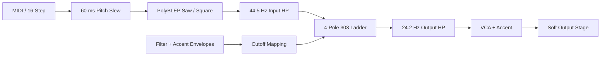

# ACIDIFY – Produkt- und DSP-Konzept

## 1. Zielbild

ACIDIFY soll die Spielweise und den Klangcharakter einer Roland TB-303 in Amorph
reproduzieren:

- monophoner Bass-Synth mit Saw/Square-Oszillator,
- resonanter Vierpol-Diodenleiter-Tiefpass,
- Filterhüllkurve mit Decay und zusätzlichem Accent-Verlauf,
- Accent, der Filter und Lautstärke gemeinsam beeinflusst,
- feste, musikalisch erkennbare Slide-Charakteristik,
- 16-Step-Sequencer mit Gate, Accent und Slide pro Schritt,
- haptisch wirkendes, proportionsgetreues Silber/Beige-Panel.

Die erste Version ist bewusst eine **messbare Grundlage**. „AAA“ wird erst dann
beansprucht, wenn Referenzaufnahmen mehrerer Originalgeräte bei identischen
Steuerspannungen gegen das Modell geprüft wurden.

## 2. Recherche-Ergebnis

### Primärquellen

- Das [originale Roland-Handbuch](https://cdn.roland.com/assets/media/pdf/TB-303_OM.pdf)
  beschreibt Bassline-Speicher, Pattern-Programmierung und die Hardwarebedienung.
- Die
  [Roland TB-303 Service Notes](https://notebook.zoeblade.com/Downloads/Documentation/Roland/TB-303_service_notes.pdf)
  liefern Schaltplan, Abgleichpunkte und das VCF-/Accent-Signalbild.
- Rolands aktuelle
  [TB-303-Produktspezifikation](https://www.roland.com/global/products/rc_tb-303/)
  bestätigt eine Stimme, Saw/Square, die sechs Klangparameter und 16 Steps.
- Tim Stinchcombes
  [umfassendes Diodenleiter-Modell](https://www.timstinchcombe.co.uk/index.php?pge=diode2)
  zeigt, dass nicht nur vier Pole, sondern auch die Koppelkondensatoren und
  Hochpassanteile den Bass- und Resonanzverlauf prägen.
- [Open303](https://github.com/RobinSchmidt/Open303) ist eine MIT-lizenzierte,
  quelloffene Referenz. Besonders relevant sind die gemessene Cutoff/Env-Mod-
  Abbildung, die 150-Hz-Hochpasskomponente im Resonanzpfad, die Filterrekursion,
  die 60-ms-Slide-Vorgabe und die Accent-Hüllkurven.

### Konsequenzen

Ein generischer Saw-Oszillator plus Biquad reicht nicht. Der Klang entsteht aus
dem Zusammenspiel von:

1. bandbegrenzter, aber nicht klinisch perfekter Wellenform,
2. fester Pitch-Slew-Kennlinie,
3. nichtlinearer Pegelung vor und hinter dem Filter,
4. resonanzabhängigem Vierpol-Netzwerk mit Hochpass im Feedback,
5. bipolar wirkender Filterhüllkurve,
6. getrenntem Accent-Verlauf für Cutoff und VCA,
7. kurzen Gates und verbundenen Slide-Steps.

Airwindows wurde als mögliche Effekt-Referenz geprüft. Für den 303-Kern existiert
dort kein direkter, schaltungstreuer Ersatz; ein fremder Drive-Algorithmus würde
die Referenz eher verschieben. Airwindows bleibt eine Option für einen späteren,
klar getrennten Post-FX-Modus.

## 3. DSP-Topologie

Der komplette Audio-Kern läuft als `node core = AcidifyCore * 4`. Cmajor übernimmt
hochwertige Sinc-Interpolation an der Node-Grenze; innerhalb des Kerns melden
`processor.frequency` und `processor.period` bereits die vierfache Rate.

### Oszillator

- PolyBLEP-Saw und -Square vermeiden die gröbsten digitalen Aliasprodukte.
- Square besitzt einen leicht reduzierten Pegel wie die Open303-Referenz.
- Phase wird bei vollständig abgeklungener neuer Note zurückgesetzt, bei Legato
  nicht.

### Slide

- 60 ms Nennzeit.
- Exponentieller One-Pole-Slew nach Open303-Vorbild.
- MIDI-Legato und Sequencer-Slide benutzen denselben Zustand.

### Filter- und Accent-Hüllkurven

- Normaler Filter-Decay: exponentiell von 200 bis 2000 ms.
- Filter-Attack: 3 ms RC-Glättung.
- Accent-Decay: 200 ms, Accent-Attack: 15 ms.
- Gemessene Open303-Skalierung übersetzt Cutoff und Env Mod in den momentanen
  Exponenten des Cutoffs.
- Accent beeinflusst Cutoff, VCA-Pegel und Release – nicht nur die Lautstärke.

### Diodenleiter

- Vier gekoppelte Integratorzustände nach der TB-303-Variante von Open303.
- Resonanz wird musikalisch gekrümmt.
- Ein 150-Hz-Hochpass im Feedback verhindert unpassendes Tiefton-Selbstschwingen.
- Ein- und Ausgang werden sanft nichtlinear begrenzt.
- 44.486-Hz-Pre-HP und 24.167-Hz-Post-HP bilden wichtige
  Koppelkondensator-Effekte ab.

## 4. Sequencer und Parameterbudget

Amorph garantiert 50 dynamische Parameter. ACIDIFY verwendet 44:

- 12 globale Parameter,
- 16 Step-Pitches,
- 16 gepackte Step-Flags (`gate=1`, `accent=2`, `slide=4`).

Dadurch bleiben Pattern vollständig automatisier- und speicherbar, ohne eine
private Datenbrücke zwischen UI und DSP.

## 5. UI-Konzept

Designraster: 1180 × 580 px, skaliert per CSS `zoom`.

- warmgraues ABS-Gehäuse und gebürstete Silberplatte,
- schwarzer Druck, rote LEDs, schwarze geriffelte Drehknöpfe,
- Soundregler in der originaltypischen Reihenfolge,
- linke Tempo-/Mode-Zone, rechte Volume-/Power-Zone,
- untere Programmiersektion mit 16 Step-LEDs und tastaturähnlicher Pitch-Eingabe,
- eigene Kennzeichnung `ACIDIFY AC-303`, keine Roland-Logos.

Die Materialdarstellung verwendet getrennte Licht- und Oberflächenmodelle:
Formkanten und Naht des ABS-Gehäuses, feine unregelmäßige Körnung auf der
Metallplatte, geriffelte Spritzgussflanken an den Potikappen, gefasste LED-Linsen
sowie eingelassene Taster mit sichtbarem Hub. Die Bedienelemente verändern beim
Drücken nicht nur ihre Farbe, sondern auch Höhe, Schatten und Innenlicht.
Drehregler unterstützen Pointer, Mausrad, Doppelklick sowie Pfeiltasten,
`Home` und `End`.

Die Oberfläche ist kein eingebettetes Foto. Alle Teile werden in CSS/HTML
gezeichnet und bleiben damit scharf, interaktiv und Amorph-kompatibel.

### Classic Surface / Studio Intelligence

Die 2026-UX ist als zweite Bedienebene angelegt, nicht als neues Skin. ACIDIFY
öffnet weiterhin in der Hardwareansicht. Ein kleiner eingelassener
`CLASSIC / STUDIO`-Schalter ersetzt nur den unteren Keyboard-Editor temporär
durch eine dunkle Vier-Lane-Matrix für Note, Gate, Accent und Slide.

Der Studio-Modus ergänzt:

- Shift- und additive Mehrfachauswahl,
- Drag-Paint mit einem zusammenhängenden Undo-Schritt,
- Pitch-Bearbeitung per Mausrad,
- Undo/Redo und internen Pattern-Zwischenspeicher,
- Copy/Paste, Rotate, Oktavtransposition, Rest und Smart-Randomize,
- Tastaturkürzel für Undo/Redo und Copy/Paste,
- temporäre präzise Value-Bubbles und dezente Default-Marker an Reglern.

Diese Funktionen benutzen ausschließlich den stabilen Parametervertrag
`param13..param44`. Der Studio-Modus selbst ist UI-Zustand und verändert weder
DSP noch Presetformat. Bei Rückkehr zu Classic wird wieder genau ein Step
selektiert, sodass die historische Bedienlogik eindeutig bleibt.

## 6. Verifikation bis AAA

### Bereits automatisierbar

- Amorph-Preflight und UI-Lint,
- echter Cmajor-Compile,
- Tests bei 44.1/48/96 kHz,
- Step-/MIDI-/Preset-State-Tests,
- Spektrum- und Alias-Vergleich auf isolierten Wellenformen.

### Noch erforderlich

1. Referenzgerät(e) mit kalibriertem Audiointerface aufnehmen.
2. Sweep-Matrix für Cutoff × Resonance × Env Mod × Accent erzeugen.
3. Pitch-/Gate-/Accent-CV beziehungsweise identische Pattern ausgeben.
4. Frequenzgang, Decay-Kurven, THD und Residualsignal vergleichen.
5. Modellkonstanten optimieren, ohne neue User-Parameter einzuführen.
6. Blindtest gegen mindestens zwei echte Geräte durchführen, da
   Bauteiltoleranzen zwischen Originalen hörbar variieren.

## 7. Marken- und Produktabgrenzung

TB-303 und Roland werden nur zur Beschreibung des Kompatibilitätsziels genannt.
Die auslieferbare UI verwendet eine eigene Marke und keine Original-Logos oder
kopierten Bildressourcen.
