# ACIDIFY User Manual

Version 2.18.x

---

## 1. Panel Overview

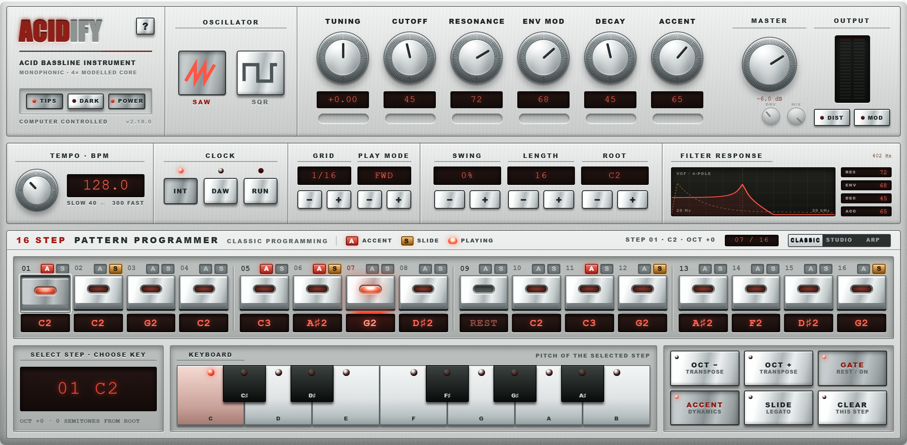

| Zone | What it is |
|---|---|
| Top left | Logo, TIPS / DARK / POWER buttons, **?** tour key |
| OSCILLATOR | SAW / SQR waveform switch |
| Knob row | TUNING, CUTOFF, RESONANCE, ENV MOD, DECAY, ACCENT |
| MASTER / OUTPUT | Master volume, DRV/MIX mini dials, level meter, DIST and MOD buttons |
| Middle strip | TEMPO, CLOCK (INT / DAW / RUN), GRID, PLAY MODE, SWING, LENGTH, ROOT, FILTER RESPONSE display |
| Bottom | 16 STEP PATTERN PROGRAMMER with three editors: CLASSIC, STUDIO, ARP |

The three editor tabs at the top right of the programmer (CLASSIC / STUDIO / ARP) switch the bottom section. Click the tab you want, or press **M** to cycle. Everything else on the panel stays the same in all three views.

---

## 2. Sound Controls

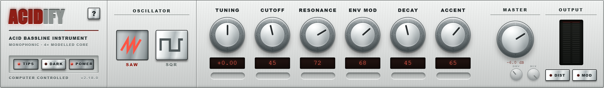

| Control | Function |
|---|---|
| **SAW / SQR** | Selects the oscillator waveform, sawtooth or square. Same two flavors as the original unit. |
| **TUNING** | Master tune, ±1 semitone around center. |
| **CUTOFF** | Filter cutoff. This sets the *resting point* of the filter. Notes still open the filter above it when ENV MOD is up (see below). |
| **RESONANCE** | Filter resonance. Full clockwise sits just under self-oscillation, like a stock unit. |
| **ENV MOD** | How much the filter envelope pushes the cutoff up on each note. **Important:** more ENV MOD also pulls the resting cutoff down between notes. That is original 303 circuit behavior, not a bug. If you want to hear the filter fully closed, turn ENV MOD down as well as CUTOFF. |
| **DECAY** | Filter envelope decay time, 200 ms to 2.5 s. On accented steps the decay is always fixed at the short 200 ms setting, exactly like the hardware. |
| **ACCENT** | How hard accented steps hit: louder through the VCA and an extra resonance-dependent filter sweep. At high RESONANCE the accent sweep gets faster and more aggressive. |
| **MASTER** | Output volume, −36 to +6 dB. Sits after the distortion stage, so it never changes the distortion character. |
| **DRV / MIX minis** | Direct access to the distortion Drive and Mix without opening the overlay. |
| **OUTPUT meter** | Peak meter with clip latch. If the red clip indicator lights, click it to reset. |
| **DIST / MOD buttons** | Open the Distortion and Circuit Mods overlays (sections 8 and 9). |

The FILTER RESPONSE display in the middle strip shows the current filter curve plus live readouts of RES, ENV, DEC and ACC.

---

## 3. Clock and Transport

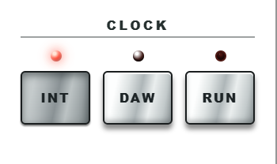

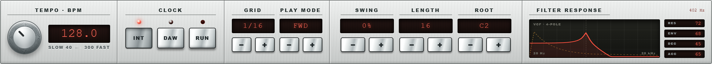

### INT mode

The internal clock runs the sequencer. Set the tempo with the TEMPO knob (mouse wheel = 0.1 BPM steps, hold Shift for 0.01) and start/stop with **RUN**.

### DAW mode

**In DAW mode the sequencer starts and stops with your DAW's transport. Press play in the DAW to make ACIDIFY play.** The RUN button switches to FOLLOW and the tempo knob mirrors the host tempo; both are read-only while the host is in control.

Notes on DAW mode:

- In FWD play mode the pattern locks to the DAW's song position: bar 1 beat 1 is step 1, and jumping the playhead in the DAW jumps the pattern with it. The other play modes (REV, pendulum, INVERT, RND) advance one step per grid tick instead, since they have no fixed song-position mapping.
- If the host does not deliver transport information at all, RUN and TEMPO keep working as a manual fallback so the instrument is never dead.
- Switching back to INT keeps the last host tempo as the new internal tempo.

### Grid, play mode, swing, length, root

| Control | Function |
|---|---|
| **GRID** | Step length: 1/32, 1/16T, 1/16., 1/16, 1/8T, 1/8., 1/8, 1/4T, 1/4., 1/4, 1/2, 1/1, 2/1, 3/1 |
| **PLAY MODE** | Step order: FWD, REV, FWD&REV (pendulum), INVERT (outside-in), RND (random, never the same step twice in a row) |
| **SWING** | 0–100 %. Delays every second step; at 100 % the pair splits 2/3 + 1/3 (full triplet feel). Works in INT and DAW mode. |
| **LENGTH** | Pattern length, 1–16 steps. Steps beyond the length are shown disabled. |
| **ROOT** | Root note of the pattern (C1–C4). All step pitches are relative to this. |

---

## 4. MIDI Input: What Plays When

This is the part that confuses everyone once, so here is the whole rule set:

| Situation | What MIDI notes do |
|---|---|
| **Sequencer stopped** (RUN off, or DAW transport stopped) | MIDI notes play directly, like a mono synth. Velocity 100 or higher triggers an accent. Playing legato (new note while holding the old one) slides between the notes. |
| **Sequencer running, CLASSIC or STUDIO editor** | MIDI notes are **ignored**. The 16-step pattern is the only note source, exactly like the original 303. Program the pattern instead of playing it. |
| **Sequencer running, ARP editor** | MIDI notes feed the arpeggiator: hold a chord and the arp plays it. The pattern still provides the rhythm: its gates, accents and slides act as a step mask, only the pitches come from your chord. |
| Any time | MIDI CC 120 / CC 123 = all notes off. |

So: if you send ACIDIFY notes and hear nothing, check whether the sequencer is running while you are in CLASSIC or STUDIO. Either stop the transport to play live, or switch to ARP to play into the running sequence.

---

## 5. Programming Patterns: CLASSIC Editor

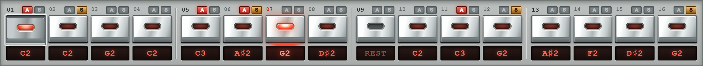

The step row is always visible. Each of the 16 steps has:

- a **gate button** (lit = the step plays, dark = rest),
- an **A pill** (accent) and an **S pill** (slide) directly above it,
- a **pitch readout** below it.

Direct actions on a step:

| Action | Result |
|---|---|
| Click | Select the step for editing |
| Double-click | Toggle the gate (note/rest) |
| Mouse wheel | Change pitch in semitones |
| Right-click | Note picker menu |
| Click A / S pill | Toggle accent / slide for that step |

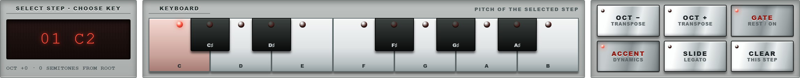

The editor below shows the selected step. Use the **KEYBOARD** to set its pitch, and the buttons on the right:

| Button | Function |
|---|---|
| **OCT − / OCT +** | Transpose the selected step one octave down/up |
| **GATE** | Toggle note/rest |
| **ACCENT** | Toggle accent (louder + filter bite) |
| **SLIDE** | Ties this step to the next: the note holds through the step and glides into the next pitch. This is the classic 303 slide. |
| **CLEAR** | Reset the step |

Slide behavior detail: a slide on step N makes step N run at full length and glide into step N+1. Without slide, each note plays half the step length, then releases.

---

## 6. STUDIO Editor

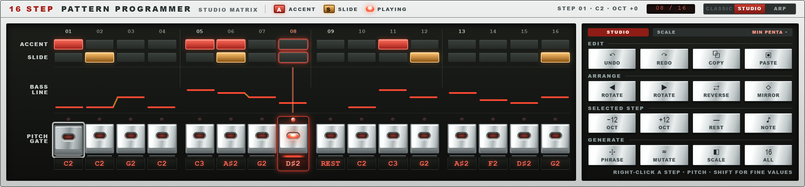

The same pattern as a matrix, for fast editing:

- **ACCENT / SLIDE lanes** – click cells to toggle. Drag to paint several steps in one stroke.
- **BASS LINE lane** – the pitch contour. Mouse wheel on a cell changes its pitch; right-click opens the note picker.
- **PITCH GATE lane** – gates plus pitch readouts, same interactions as the classic step row.

Multi-select: drag across cells, then use the tool panel on the right:

| Group | Tools |
|---|---|
| **EDIT** | UNDO, REDO, COPY, PASTE (keyboard shortcuts work too) |
| **ARRANGE** | ROTATE left/right, REVERSE the pattern, MIRROR the pitches |
| **SELECTED STEP** | −12 / +12 octave, REST, NOTE picker |
| **GENERATE** | PHRASE (writes a phrase from the acid bank into the pattern), MUTATE (varies the current pattern), SCALE (pick the scale used for generation, e.g. MIN PENTA), 16/ALL (apply range) |

Hold Shift while dragging any value for fine control.

---

## 7. ARP Editor

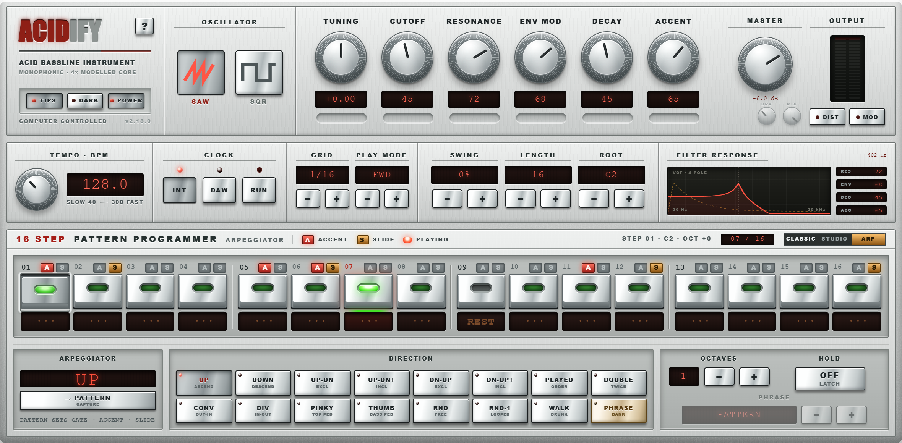

Switch to ARP, start the sequencer, and **hold notes or a chord on your MIDI keyboard** – the arpeggiator plays them in the selected figure. The step row still runs the show rhythmically: gates, accents and slides come from the pattern, pitches come from your hand.

| Control | Function |
|---|---|
| **DIRECTION** | 16 figures: UP, DOWN, UP-DN (exclusive), UP-DN+ (inclusive), DN-UP, DN-UP+, PLAYED (in the order you pressed them), DOUBLE (every note twice), CONV (outside-in), DIV (inside-out), PINKY (top note between every note), THUMB (bottom note between every note), RND, RND-1 (one random draw, then looped), WALK (random neighbor steps), PHRASE |
| **OCTAVES** | Extends your held notes over 1–4 octaves |
| **HOLD** | Latch: keep playing after you release the keys. Press new keys to replace the chord. |
| **PHRASE** | In PHRASE mode: bank selector. "PATTERN" (position 0) plays your own pattern's pitches transposed by the held key; positions 1–90 play the built-in acid phrase bank, transposed by the held key. |
| **→ PATTERN (capture)** | Copies the currently playing phrase into your own 16-step pattern, so you can edit it in CLASSIC or STUDIO. |

The display above shows the current figure and the note currently played by the arp.

---

## 8. CIRCUIT MODS Overlay (MOD button)

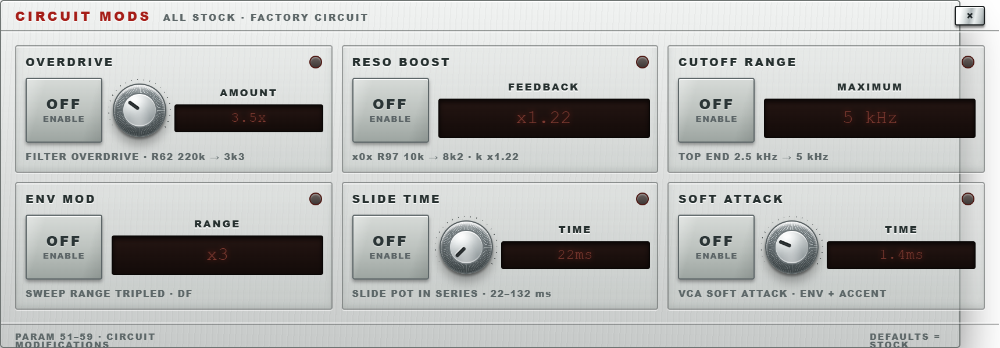

Six famous hardware modifications, each one a real component change from the Devil Fish and x0x mod documentation. Every mod has its own ON/OFF switch, so the plugin is a bone-stock 303 until you flip something. Defaults = stock.

| Mod | Effect |
|---|---|
| **OVERDRIVE** | Filter input overdrive (R62 220k → 3k3). Amount sets the drive factor up to ~66×. The filter itself starts to growl. |
| **RESO BOOST** | x0x resonance mod (R97 10k → 8k2): feedback ×1.22, pushes the filter into self-oscillation territory. |
| **CUTOFF RANGE** | Raises the cutoff ceiling from 2.5 kHz to 5 kHz. |
| **ENV MOD ×3** | Triples the envelope modulation range. |
| **SLIDE TIME** | Puts a pot in series with the slide circuit: slide time 22–132 ms instead of fixed 22 ms. |
| **SOFT ATTACK** | Replaces the hardware's snappy attack (and its ~4 ms gate delay) with an adjustable 0.5–30 ms ramp. |

Close the overlay with the X button, Escape, or a click outside.

---

## 9. DISTORTION Overlay (DIST button)

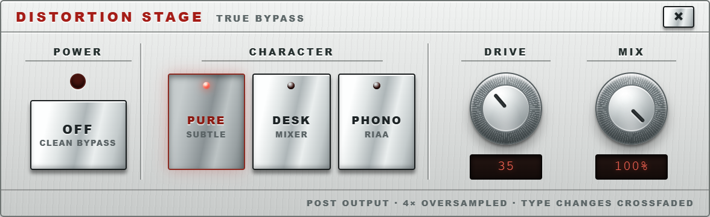

Post-filter drive stage, 4× oversampled, true bypass when off.

| Control | Function |
|---|---|
| **POWER** | Enable / clean bypass |
| **CHARACTER** | **PURE** – subtle level-dependent saturation. **DESK** – modeled compact-mixer preamp crunch. **PHONO** – the 90s trick: a 303 plugged into the phono input of a home amplifier, RIAA curve and all. From warm to fully blown out. |
| **DRIVE** | Amount of drive for the selected character |
| **MIX** | Dry/wet blend |

All three characters are loudness-matched to the clean signal, so switching characters or turning Drive does not jump your level. Type changes are crossfaded – you can switch while playing.

Note: the distortion sits *after* the filter. Harmonics it creates are not affected by CUTOFF.

---

## 10. Global Controls and Gestures

| Control | Function |
|---|---|
| **TIPS** | Tooltips on/off. With TIPS on, hovering any control shows exactly what it does — the fastest way to learn the panel. |
| **?** | Opens the guided tour: 14 pages that walk through the panel and highlight the control they describe. Arrow keys page, Escape closes. |
| **DARK** | Switches between the silver and anthracite look. |
| **POWER** | Full plugin bypass. |

| Gesture | Works on |
|---|---|
| Mouse wheel | Every knob, display, step and matrix cell |
| Shift + drag / Shift + wheel | Fine adjustment everywhere |
| Double-click on a step | Gate toggle |
| Right-click on a step or cell | Note picker |
| **M** | Cycle CLASSIC → STUDIO → ARP |
| Escape | Close overlays |

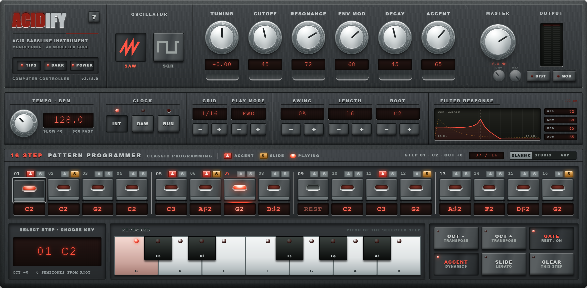
